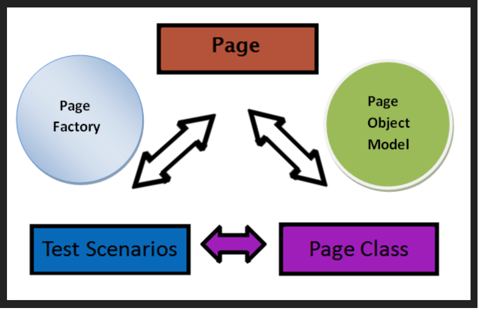
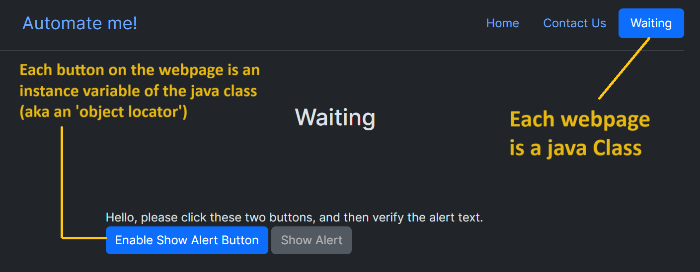
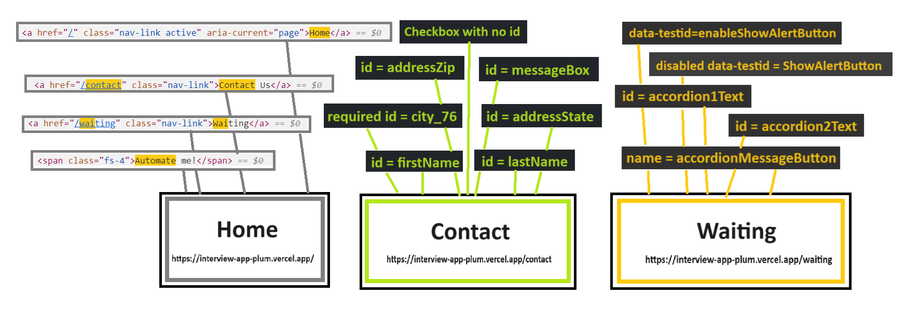
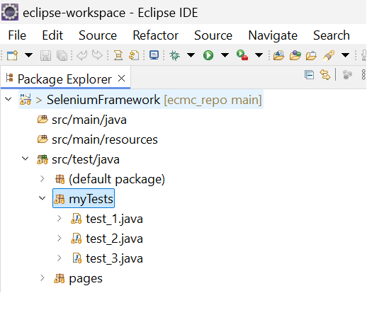
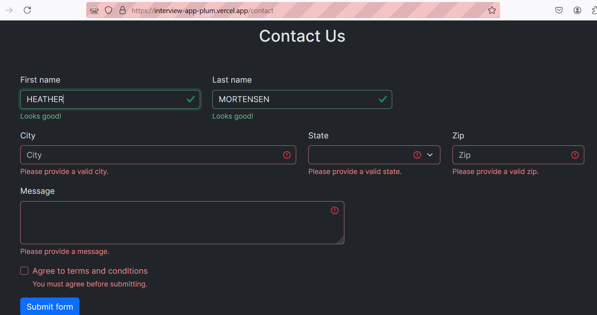
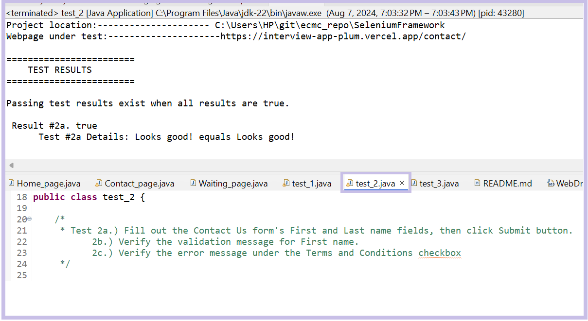
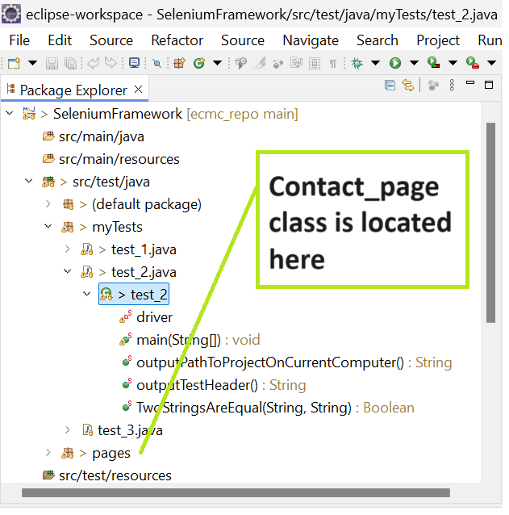

# ECMC Project

**TO DO**

8/8/2024

[ ] I might have the wrong driver for Chrome <br>
[ ] Look at the details of XPath - Dynamic web elements in Selenium <br>
	I can see the id for the city field is changing on refresh. Could use Contains() method <br>
	There's some kinda tool called SelectorsHub that helps with this. <br>
[ ] How do I identify the button on the contact us page. Does that lack both an id and a name? Is that why I forgot to put it into my class diagram? <br>
[ ] Cite things <br>
[ ] <br>

## Required Software Installations & Configuration


First, I installed Java. Next, I installed the Eclipse IDE for Enterprise Java and Web Developers (includes Incubating components).
Git came preinstalled - packaged inside this version of Eclipse. That was followed by a Maven (package manager) installation. Note that Maven comes preinstalled inside newer versions of Eclipse. I created a Maven project inside the Eclipse workspace and added a selenium dependency inside the pom.xlm file. Note that if I would have installed Selenium v4.26.0 (I think), then the browser drivers would have come all prepackaged inside selenium. 

Detailed instructions can be found at the following link: [Selenium Framework for Beginners 1 | Getting Started | How to setup Selenium Java project in Eclipse]: https://www.youtube.com/watch?v=nCJoia7wosc


| **Operating System**        | **Selenium**  | **Maven**  | **Java**  | **Eclipse**                         |
|-----------------------------|---------------|------------|-----------|-------------------------------------|
| Windows 11 v10.0.22631.3880 |   v4.23.0     | v3.9.8     | v22.0.2   |  v4.32.0, Build id: 20240606-1231   |

### Browser Installations & Configuration

| **Browser**                         | **Browser Driver**                              | **Driver Location**                                             |
|-------------------------------------|-------------------------------------------------|-----------------------------------------------------------------|
|Firefox v129.0 (64-bit)              |   geckodriver-v0.35.0-win64                     |/SeleniumFramework/drivers/geckodriver/geckodriver-v0.35.0-win64 |
|                                     |                                                 |                                                                 |
| **Browser**                         | **Browser Driver**                              | **Driver Location**                                             |
|IE                                   |   NA                                            | NA                                                              |
| **Browser**                         | **Browser Driver**                              | **Driver Location**                                             |
|Chrome V127.0.6533.90 (64-bit)       |   NA                                            | /SeleniumFramework/drivers/chromedriver/chromedriver-win64      |

Note: Chrome updated during project work to Version 127.0.6533.100 (8/8/2024 @ 9:43am)
Note: Browsers shown in the table in white cells are fully configured. Run the tests in Firefox. Browsers displayed inside gray cells do not have their drivers fully setup.

## POM Model

I will use Page Object Model (POM) to construct 3 website tests using Selenium, Maven, and Java.

POM can be visualized, at a high level, as fitting into a Page Factory design pattern. (See Figure 1)


**Figure 1.** Abstract Visualization of the Page Object Model

Lets define our POM more concretely and make it relevant to our current project.
Each webpage is its own class. Instance variables of each class are webpage components (aka "locators") that a user interacts with.


**Figure 2.** Defining the Page Object Model More Specifically to this Use Case

HTML attributes might be relevant to testing, so I included them in the class diagram shown in figure 3. Those identified in figure 3 are id, required id, name, data-tested. What is a data-testid? https://medium.com/@automationTest/why-your-development-team-should-use-data-testid-attributes-a83f1ca27ebb

I construct the POM as illustrated in figure 3. The website has three pages, therefore a class diagram has three classes. Instance variables for classes we intend to test are shown in black. Untested classes have instance variables Shown in white.

[ ] TO DO: I forgot to add the button onto the drawing in the Contact Us class (figure 3)


**Figure 3.** Three Page Classes - Home class, Contact class, and Waiting class
  
[ ] TO DO: Mention the Dynamic web elements (@id = city_76, city_3, etc) here.

We create 3 tests. Each test is written in a separate class file at the following location inside Eclipse: /SeleniumFramework/src/test/java/myTests



**Figure 4.** Location of the test files inside the eclipse project

### Tests: 
### --------------------------------------------------------------------------------------------------------------------------

### Test 1.) Submit a successful Contact Us request, and verify the message on the success page. <br>

<br>
### Test 2a.) Fill out the Contact Us form's First and Last name fields, then click Submit. <br>

### Test 2b.) Verify the validation message for First name. <br>
<br>
### Test 2c.) Verify the error message under the Terms and Conditions checkbox. <br>
<br>

### Test 3.) On the Waiting page, please wait for the page to load, and then follow the instructions to verify the two alerts. <br>
<br>

An illustration of how we incorporate those tests is shown below in figure 5.


**Figure 5.** Some pic that incorporates the tests

## Test 1 Details


## Test 2 Details

Figure 6 shows output from the Contact Us webpage after input is entered by the user.


**Figure 6.** Contact Us Webpage output after user input

Figure 7 illustrates test output into console. 


**Figure 7.** Test 2 output into console

Figure 8 shows where to find relevant files related to the test inside the eclipse package. The 'Contact Us' webpage has a corresponding class at /SeleniumFramework/src/test/java/pages/Contact_page.java inside the eclipse project. 

Code related to test 2 exists at the following location: /SeleniumFramework/src/test/java/myTests/test_2.java.



**Figure 8.** Files related to test 2 inside the java package structure

##Test 3 Details

```
git add .
git commit -am "I have made some changes."
// git checkout develop
//git merge --no-ff my-feature-branch
git push origin develop
git status
```
